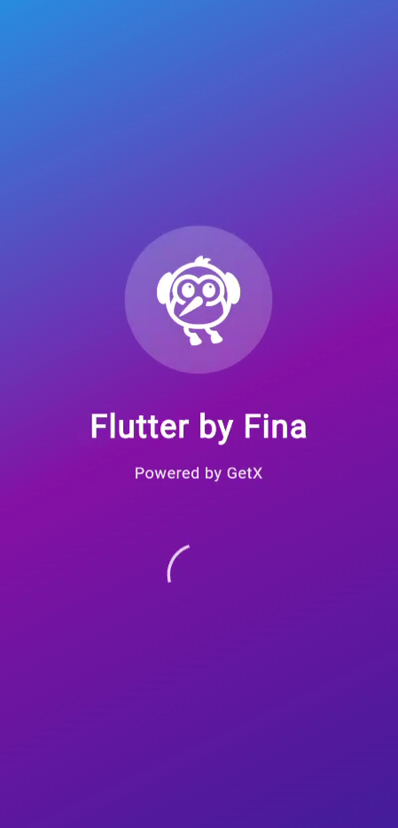
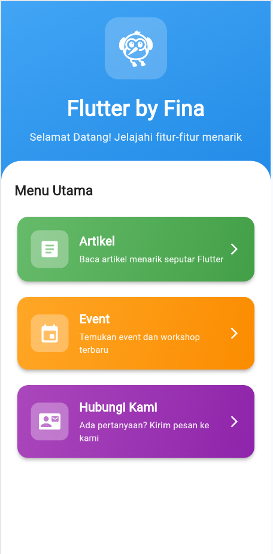
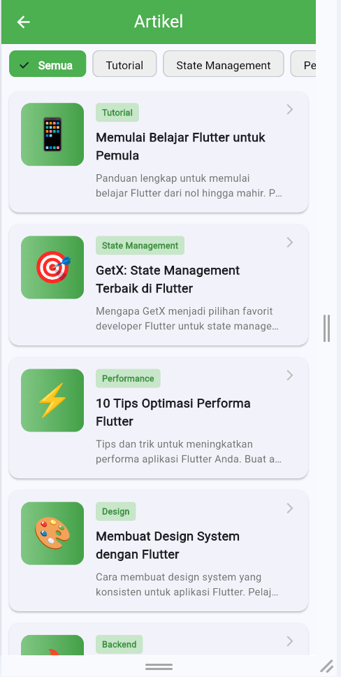
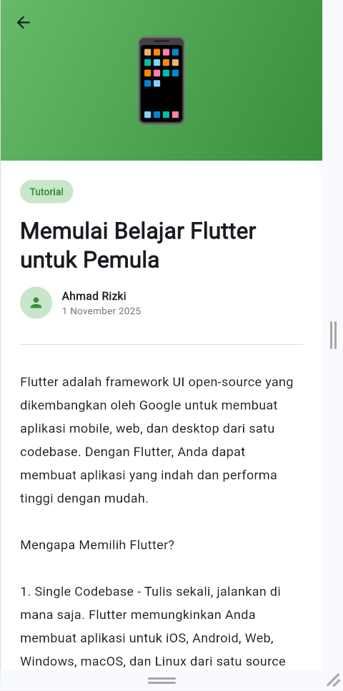
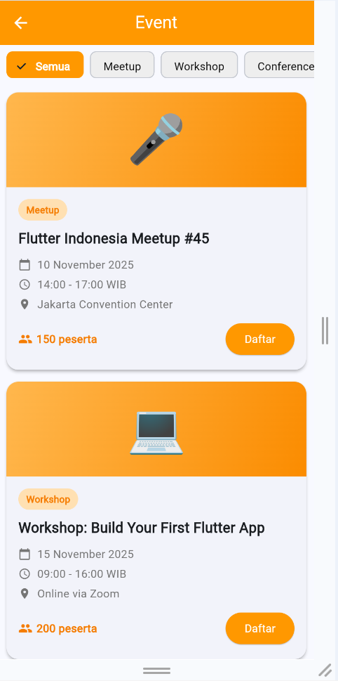
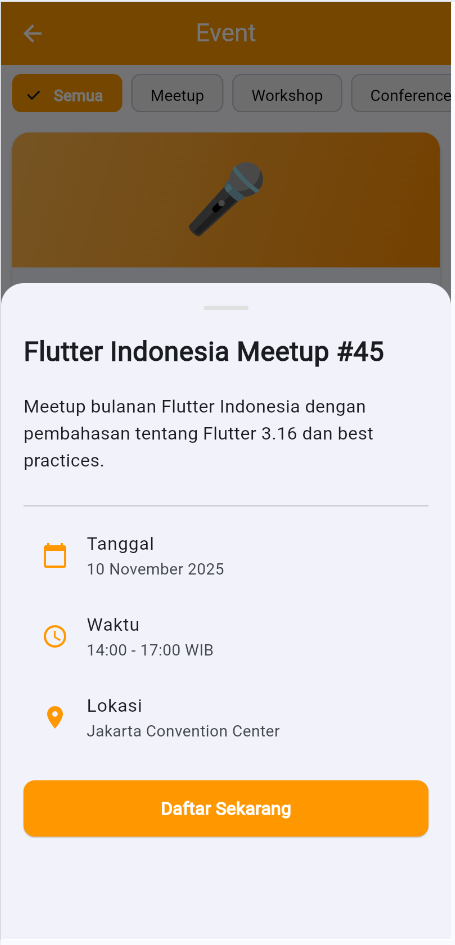
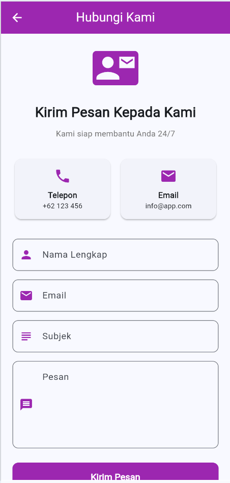

# H1D023119-Fina-Julianti-Pemrograman-Mobile-C

**Deskripsi Singkat:**
Aplikasi mobile berbasis Flutter yang mengimplementasikan state management menggunakan GetX. Aplikasi ini menampilkan artikel, event, dan informasi kontak dengan navigasi yang terstruktur dan tampilan yang responsif.

---

### Identitas Diri

- **Nama:** Fina Julianti
- **NIM:** H1D023119
- **Kelas:** Pemrograman Mobile C
- **Jurusan:** Informatika
- **Universitas:** Universitas Jenderal Soedirman

---

## Fitur Aplikasi

Aplikasi ini memiliki beberapa halaman utama:

1. **Splash Screen** - Halaman pembuka dengan animasi
2. **Home Page** - Halaman utama dengan menu navigasi
3. **Articles Page** - Menampilkan daftar artikel dengan filter kategori
4. **Article Detail Page** - Detail lengkap artikel
5. **Events Page** - Informasi event dan workshop
6. **Contact Us Page** - Form kontak dan informasi media sosial

---

## Teknologi yang Digunakan

- **Flutter** - Framework untuk pengembangan aplikasi mobile
- **GetX** - State management dan navigasi
- **Dart** - Bahasa pemrograman

---

## Struktur Aplikasi

```
lib/
 main.dart
 routes/
    app_routes.dart
    app_pages.dart
 pages/
    splash_screen.dart
    home_page.dart
    articles_page.dart
    article_detail_page.dart
    events_page.dart
    contact_us_page.dart
 controllers/
    article_controller.dart
    event_controller.dart
    contact_controller.dart
 models/
     article.dart
     event.dart
```

---

## Demo Aplikasi

### Video Demo


---

## Screenshot Aplikasi

### Splash Screen


### Halaman Utama


### Halaman Artikel


### Detail Artikel


### Halaman Event


### Detail Event


### Halaman Kontak


---

## Cara Menjalankan Aplikasi

1. Clone repository ini
   ```bash
   git clone https://github.com/finadio/H1D023119_Aplikasi-Flutter-Sederhana_CPMK-3-Pemrograman-Mobile-C.git
   ```

2. Masuk ke direktori project
   ```bash
   cd flutter_getx_app
   ```

3. Install dependencies
   ```bash
   flutter pub get
   ```

4. Jalankan aplikasi
   ```bash
   flutter run
   ```

---
**© 2024 Fina Julianti - Universitas Jenderal Soedirman**
